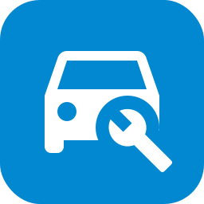

# Car Maintenance for Home Assistant



Track vehicle maintenance with progress sensors: service inspections by time
and/or driven distance, vehicle inspection (STK), highway vignette, oil, brakes,
tires and any custom counter.

- One integration entry per vehicle, any number of counters per vehicle.
- Counters track a time interval, a distance interval, or both; progress is
  driven by whichever is more exhausted.
- Optional odometer entity; without it counters work by time only.
- Kilometers or miles, selectable per vehicle.
- Progress direction 0 -> 100 (default) or 100 -> 0, selectable per vehicle.
- A "done" button per counter resets it to today at the current odometer
  reading.
- Warning binary sensor per counter for automations (default threshold 90 %).
- Localized in en, cs, de, es, fr, it, nl, pl and pt-BR; entity names and
  counter templates follow the Home Assistant UI language.

Requires Home Assistant 2025.3 or newer.

## Installation (HACS)

1. HACS -> three-dot menu -> Custom repositories.
2. Add this repository URL, category "Integration":

   ```text
   https://github.com/007hacky007/car_maintenance
   ```

3. Install "Car Maintenance" and restart Home Assistant.
4. Settings -> Devices and services -> Add integration -> Car Maintenance.

## Configuration

Create a vehicle (name, optional odometer entity, unit, progress direction),
then add counters to it from the integration page. Templates prefill common
intervals (service 1 year / 15000 km, vehicle inspection 2 years, vignette
1 year, ...); everything can be adjusted.

Each counter provides:

| Entity | Meaning |
|--------|---------|
| `sensor.<vehicle>_<counter>_progress` | progress in %, capped 0-100 |
| `sensor.<vehicle>_<counter>_remaining_days` | days until due (negative = overdue) |
| `sensor.<vehicle>_<counter>_remaining_distance` | distance until due |
| `sensor.<vehicle>_<counter>_due_date` | next due date |
| `binary_sensor.<vehicle>_<counter>_warning` | on at the warning threshold, `overdue` attribute |
| `button.<vehicle>_<counter>_done` | mark as done today |

The progress sensor exposes `exhausted_percent`, `remaining_percent`,
`time_percent`, `km_percent`, `limiting_factor`, `last_service_date`,
`last_service_odometer` and `due_odometer` attributes (distances in km).

## Dashboard

Horizontal progress bars work great with
[entity-progress-card](https://github.com/francois-le-ko4la/lovelace-entity-progress-card)
(install via HACS):

```yaml
type: custom:entity-progress-card
entity: sensor.octavia_service_inspection_progress
name: Service inspection
icon: mdi:car-wrench
bar_color: var(--state-icon-color)
```

Overview of all counters of a vehicle:

```yaml
type: vertical-stack
cards:
  - type: custom:entity-progress-card
    entity: sensor.octavia_service_inspection_progress
    name: Service
  - type: custom:entity-progress-card
    entity: sensor.octavia_vehicle_inspection_progress
    name: STK
  - type: custom:entity-progress-card
    entity: sensor.octavia_highway_vignette_progress
    name: Vignette
```

Notification automation example:

```yaml
triggers:
  - trigger: state
    entity_id: binary_sensor.octavia_service_inspection_warning
    to: "on"
actions:
  - action: notify.mobile_app_phone
    data:
      message: >-
        Service inspection due soon:
        {{ states('sensor.octavia_service_inspection_remaining_days') }} days
        or {{ states('sensor.octavia_service_inspection_remaining_distance') }} km left.
```

## License

MIT
